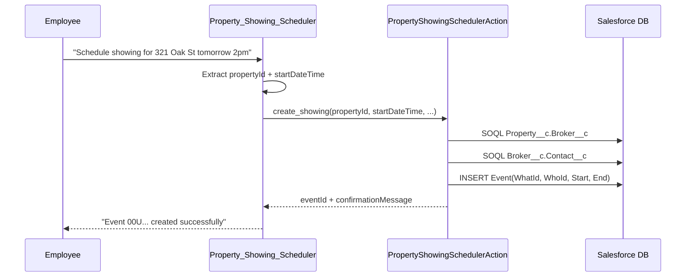
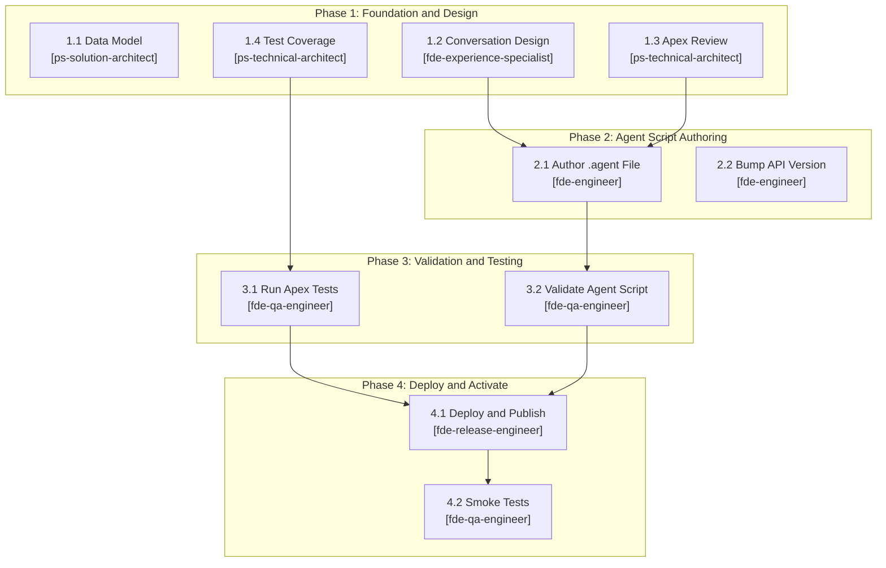

# UC2: Employee Property Showing Scheduling Agent — Implementation Plan

> **Mode:** Plan Mode (role-assigned implementation tasks)
> **Date:** 2026-04-06
> **Source:** Cursor Plan `uc2_agent_implementation`

---

## Architecture

---

## Key Files

| File | Status | Owner |
|---|---|---|
| `force-app/main/default/classes/PropertyShowingSchedulerAction.cls` | Exists — no changes needed, I/O names already match | `ps-technical-architect` (review) |
| `force-app/main/default/classes/PropertyShowingSchedulerActionTest.cls` | Exists — enhance with edge-case tests | `ps-technical-architect` |
| `force-app/main/default/aiAuthoringBundles/Property_Showing_Scheduler/Property_Showing_Scheduler.agent` | **To be created** | `fde-engineer` |
| `sfdx-project.json` | Exists — bump API version 65.0 → 66.0 | `fde-engineer` |
| `demo/UC2_EmployeeSchedulingAgent/ASKMODE_PLANNING.md` | Exists — full planning transcript with Agent Script spec, data model, smoke tests | Reference |

---

## Critical Constraints

- **Employee Agent**: no `default_agent_user` field (forbidden)
- **API v66.0**: required for Agent Script — must bump `sfdx-project.json` first
- **I/O name matching**: Agent Script `inputs:`/`outputs:` names must exactly match `@InvocableVariable` field names (`propertyId`, `startDateTime`, `durationMinutes`, `subject`, `eventDescription`, `eventId`, `confirmationMessage`, `errorMessage`)
- **`developer_name`** must match bundle folder: both `Property_Showing_Scheduler`
- **`datetime`/`integer`**: valid only in action I/O, not as mutable/linked variable types
- **Publish does NOT activate**: explicit `sf agent activate` required after publish

---

## Role-Assigned Tasks

### Phase 1: Foundation & Design (Parallel)

| Task | Assigned To | Description | Status |
|---|---|---|---|
| **1.1** | `ps-solution-architect` | Validate data model: confirm Property__c.Broker__c and Broker__c.Contact__c lookups, verify enableActivities=true on Property__c, create ERD and sequence diagrams (Mermaid), document permission set requirements for Property__c/Broker__c/Event CRUD+FLS | Pending |
| **1.2** | `fde-experience-specialist` | Design conversation experience: author agent persona (professional scheduling-assistant tone), write system.messages.welcome, system.messages.error, system.instructions, topic reasoning instructions for schedule_showing, and 10+ sample utterances | Pending |
| **1.3** | `ps-technical-architect` | Review PropertyShowingSchedulerAction.cls: confirm bulkification, error handling, governor limit safety (2 SOQL + 1 DML), and verify @InvocableVariable field names match the planned Agent Script I/O names exactly | Pending |
| **1.4** | `ps-technical-architect` | Enhance PropertyShowingSchedulerActionTest.cls: add tests for past startDateTime, blank propertyId, null request list, default duration (30 min), default subject (Property Showing), broker with null Contact__c. Target 90%+ coverage | Pending |

### Phase 2: Agent Script Authoring (Sequential — depends on Phase 1)

| Task | Assigned To | Description | Depends On | Status |
|---|---|---|---|---|
| **2.1** | `fde-engineer` | Author Property_Showing_Scheduler.agent file: config (EmployeeAgent, no default_agent_user), system (from task 1.2), variables (string/boolean only), start_agent entry, topic schedule_showing with apex://PropertyShowingSchedulerAction action, complete I/O schemas, post-action conditionals. Verify activation checklist | 1.2, 1.3 | Pending |
| **2.2** | `fde-engineer` | Update sfdx-project.json sourceApiVersion from 65.0 to 66.0 (required for Agent Script) | — | Pending |

### Phase 3: Validation & Testing (Parallel — depends on Phase 2)

| Task | Assigned To | Description | Depends On | Status |
|---|---|---|---|---|
| **3.1** | `fde-qa-engineer` | Run Apex tests: sf apex run test --class-names PropertyShowingSchedulerActionTest, validate all pass, confirm coverage >= 85% | 1.4 | Pending |
| **3.2** | `fde-qa-engineer` | Validate agent script: sf agent validate authoring-bundle --api-name Property_Showing_Scheduler, confirm clean validation | 2.1 | Pending |

### Phase 4: Deployment & Activation (Sequential — depends on Phase 3)

| Task | Assigned To | Description | Depends On | Status |
|---|---|---|---|---|
| **4.1** | `fde-release-engineer` | Deploy Apex to org, publish agent bundle (sf agent publish authoring-bundle), activate agent (sf agent activate) | 3.1, 3.2 | Pending |
| **4.2** | `fde-qa-engineer` | Post-deployment smoke tests: run 5 test utterances via sf agent preview, verify Event records created with correct WhatId (Property), WhoId (Broker Contact), OwnerId (employee) | 4.1 | Pending |

---

## Task Dependency Graph

