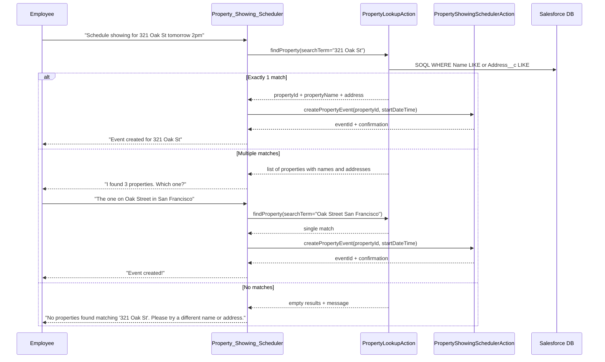
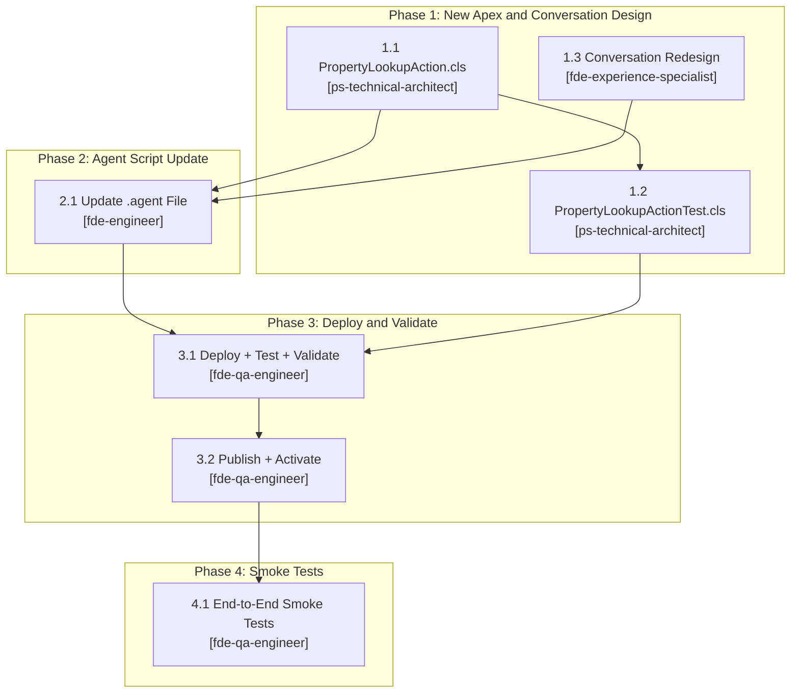

# UC2: Property Name/Address Lookup Enhancement — Implementation Plan (v0.0.2)

> **Mode:** Plan Mode (research, evaluation, and role-assigned implementation tasks)
> **Date:** 2026-04-07
> **Source:** Cursor Plan `property_name_lookup_enhancement`
> **Prerequisite:** v0.0.1 agent deployed and active (Property_Showing_Scheduler)

---

## Table of Contents

1. [Problem Statement](#problem-statement)
2. [Research Phase — Codebase Exploration](#research-phase--codebase-exploration)
3. [Standard Action Evaluation](#standard-action-evaluation)
4. [Design Decision — Custom Apex Lookup](#design-decision--custom-apex-lookup)
5. [Architecture — Before vs After](#architecture--before-vs-after)
6. [Detailed Design](#detailed-design)
7. [File Inventory](#file-inventory)
8. [Subagent Assignments](#subagent-assignments)
9. [Task Dependency Graph](#task-dependency-graph)
10. [Key Constraints](#key-constraints)

---

## Problem Statement

The v0.0.1 Property_Showing_Scheduler agent requires users to provide a raw Salesforce record ID (`propertyId`) to schedule a showing. This is a poor user experience — employees naturally refer to properties by name ("321 Oak St") or address, not by 18-character Salesforce IDs like `a00Kj00000ABC123`.

**Goal:** Refactor the agent to accept property Name (`Name`) or address (`Address__c`) as input. If a search returns multiple matches, present a disambiguation list for the user to select from. If no matches are found, prompt the user to try a different search term.

---

## Research Phase — Codebase Exploration

### Action: Explore agent metadata and project structure

**Reasoning:** Before designing any changes, need to understand the current agent architecture, Apex action signatures, Property__c data model, and any constraints learned from v0.0.1 bug fixes.

**Files read in parallel:**

| File | Key Findings |
|------|-------------|
| `PropertyShowingSchedulerAction.cls` | `@InvocableMethod` with `Request.propertyId` (String, required). Queries `Property__c` by Id, resolves `Broker__c.Contact__c`, creates `Event`. Response fields initialized to `''` (v0.0.1 bug fix). |
| `PropertyShowingSchedulerActionTest.cls` | 9 test methods, 89% coverage. Tests use `propertyRecord.Id` directly — no name-based lookup. |
| `Property_Showing_Scheduler.agent` | Single topic `schedule_showing` with one action `create_showing` targeting `apex://PropertyShowingSchedulerAction`. `propertyId` is `is_user_input: True`. |
| `Property__c.object-meta.xml` | `Name` field is Text (Property Name label). `enableActivities: true`. `enableSearch: true`. |
| `Address__c.field-meta.xml` | Text(100), not required, not unique. |
| `City__c.field-meta.xml` | Text(50), not required. |
| `State__c.field-meta.xml` | Text(20), not required. |
| `Zip__c.field-meta.xml` | Text(10), not required. |
| `genAiPlannerBundles/.../input/schema.json` | Published action schema shows `propertyId` as `lightning__textType`, `copilotAction:isUserInput: true`. |

**v0.0.1 bug fixes reviewed:**

| Bug Fix | Lesson Learned |
|---------|---------------|
| `null-vs-empty-string-success-branch.md` | All Apex Response fields MUST initialize to `''` (not null). Agent Script treats `null != ""` as truthy. Only two-operand compound conditions (`A and B`) are supported. |
| `FIX_schedule_complete_variable_never_set_to_true.md` | Don't declare variables that are never written to. Prefer existing output fields (`event_id`) as success guards over dedicated booleans. |

### Action: Read v0.0.1 planning and execution transcripts

**Reasoning:** Understand the team roster, subagent assignment patterns, and deployment workflow established in v0.0.1 so v0.0.2 follows the same conventions.

**Key findings from v0.0.1:**
- Team roster: `ps-technical-architect` (Apex), `fde-engineer` (Agent Script), `fde-experience-specialist` (conversation design), `fde-qa-engineer` (testing), `fde-release-engineer` (deployment), `ps-solution-architect` (data model)
- Phased approach: Foundation → Authoring → Validation → Deployment
- Agent Script constraints: `datetime`/`integer` only in action I/O (not mutable variables), `developer_name` must match bundle folder, publish does NOT activate

---

## Standard Action Evaluation

### Action: Research Agentforce built-in "Identify Record by Name" action

**Reasoning:** The user requested using "out of the box lookup action in Agentforce." Before building custom Apex, evaluate whether the standard `IdentifyRecordByName` action can meet the requirements.

**Research conducted:**
1. Searched Salesforce developer docs, Agentforce workshop exercises, and Agent Script reference
2. Fetched the Agentforce workshop Exercise 3 (Standard Actions) page
3. Reviewed the Agent Script actions reference for `standardInvocableAction://` target type
4. Found the action referenced as `IdentifyRecordByName` in test metadata (AiEvaluationDefinition XML)
5. Reviewed Lightning Types documentation showing the action's UI rendering

**Findings:**

| Capability | IdentifyRecordByName | Custom Apex Lookup |
|-----------|---------------------|-------------------|
| Match on `Name` field | Yes | Yes |
| Match on `Address__c` | No | Yes |
| Match on `City__c` | No | Yes |
| Partial/fuzzy matching | No (exact name match) | Yes (LIKE '%term%') |
| Multi-field compound search | No | Yes (Name OR Address OR City) |
| Formatted disambiguation list | No (returns record references) | Yes (numbered list string) |
| Configurable result limit | No | Yes (LIMIT 10) |
| SOQL injection protection | N/A (platform-managed) | Yes (manual escaping) |

**Standard action limitations for this use case:**
- Only matches the standard `Name` field — cannot search `Address__c`, `City__c`, or combine multiple fields
- Does not support partial/fuzzy matching (e.g., "Oak St" matching "321 Oak Street")
- Cannot return a formatted disambiguation list when multiple records match
- Property__c records have both a name and a street address that users may reference interchangeably
- The action is typically added via the Agent Builder UI, not Agent Script DSL (less documented path for `standardInvocableAction://IdentifyRecordByName`)

### Action: Present implementation options to user

**Reasoning:** Three valid approaches exist — let the user choose based on their priorities.

**Options presented:**
1. **Hybrid:** Keep `.agent` file for scheduling, add standard action via Setup UI after publishing
2. **Agent Script only:** Use `standardInvocableAction://IdentifyRecordByName` as target in Agent Script DSL
3. **Custom Apex fallback:** Create `PropertyLookupAction.cls` with multi-field LIKE search

**User selected:** Option 3 — Custom Apex fallback

---

## Design Decision — Custom Apex Lookup

**Rationale:** The standard `IdentifyRecordByName` action is insufficient for this use case because Property__c records are identified by employees using street addresses, city names, and partial name fragments — not just the standard `Name` field. A custom Apex `@InvocableMethod` provides full control over:

1. **Multi-field SOQL search** — `Name`, `Address__c`, `City__c` with `LIKE`
2. **Structured result handling** — single match (auto-resolve), multiple matches (disambiguation list), no matches (error message)
3. **Formatted output** — newline-delimited numbered list as a single String field (Agent Script cannot handle List outputs in mutable variables)
4. **SOQL injection prevention** — escape `%`, `_`, `'` from user input before SOQL execution

**Two-action orchestration strategy:**

Rather than modifying the existing `PropertyShowingSchedulerAction` (which works correctly and is deployed), introduce a new `PropertyLookupAction` that resolves names/addresses to IDs. The agent orchestrates both actions in sequence within the `schedule_showing` topic.

---

## Architecture — Before vs After

### v0.0.1 (Before)

```
Employee → Agent: "Schedule showing for a00Kj00000ABC123 tomorrow 2pm"
Agent → PropertyShowingSchedulerAction: createPropertyEvent(propertyId="a00Kj...", startDateTime=...)
PropertyShowingSchedulerAction → DB: SOQL Property__c WHERE Id = :propertyId
PropertyShowingSchedulerAction → Agent: eventId + confirmation
Agent → Employee: "Event created."
```

### v0.0.2 (After)



---

## Detailed Design

### 1. PropertyLookupAction (New Apex Class)

```java
global with sharing class PropertyLookupAction {
    global class Request {
        @InvocableVariable(required=true)
        public String searchTerm;
    }

    global class Response {
        @InvocableVariable
        public String propertyId = '';
        @InvocableVariable
        public String propertyName = '';
        @InvocableVariable
        public String propertyAddress = '';
        @InvocableVariable
        public Integer matchCount = 0;
        @InvocableVariable
        public String matchList = '';
        @InvocableVariable
        public String errorMessage = '';
    }

    @InvocableMethod(label='Find Property')
    global static List<Response> findProperty(List<Request> requests) { ... }
}
```

**SOQL strategy:**
- Search `Name`, `Address__c`, and `City__c` with `LIKE '%term%'` (case-insensitive via Salesforce SOQL)
- `LIMIT 10` to bound results and stay within governor limits
- Return `Id`, `Name`, `Address__c`, `City__c`, `State__c` for display
- Escape `%`, `_`, `'` in user input to prevent SOQL injection

**Result handling:**
- **0 matches** — set `errorMessage` with the search term for context
- **1 match** — set `propertyId`, `propertyName`, `propertyAddress` directly
- **2+ matches** — set `matchCount`, format `matchList` as numbered list

### 2. Agent Script Changes

Add new variables and a `find_property` action to the `schedule_showing` topic:

- **New variables:** `property_id`, `property_name`, `property_address`, `match_count`, `match_list`, `lookup_error`
- **New action:** `find_property` targeting `apex://PropertyLookupAction`
- **Updated reasoning flow:**
  1. If `property_id` is empty, ask for property name/address and call `find_property`
  2. If `match_count > 1`, present `match_list` and ask user to select
  3. If `property_id` is populated, collect date/time and call `create_showing`
- **`create_showing` input change:** `propertyId` changes from `is_user_input: True` to variable-bound (`with propertyId = @variables.property_id`)

### 3. Test Coverage

`PropertyLookupActionTest` should cover:
- Exact name match (1 result)
- Partial name match (1 result)
- Address match (1 result)
- Multiple matches (2+ results)
- No matches (0 results)
- Blank search term (error)
- Null request list (empty response)

Target: 90%+ coverage on `PropertyLookupAction.cls`

---

## File Inventory

### Files to Create

| File | Owner | Description |
|------|-------|-------------|
| `force-app/main/default/classes/PropertyLookupAction.cls` | `ps-technical-architect` | Apex invocable action for property search |
| `force-app/main/default/classes/PropertyLookupAction.cls-meta.xml` | `ps-technical-architect` | Apex metadata |
| `force-app/main/default/classes/PropertyLookupActionTest.cls` | `ps-technical-architect` | Test class with 7+ methods |
| `force-app/main/default/classes/PropertyLookupActionTest.cls-meta.xml` | `ps-technical-architect` | Test metadata |

### Files to Modify

| File | Owner | Change |
|------|-------|--------|
| `force-app/main/default/aiAuthoringBundles/Property_Showing_Scheduler/Property_Showing_Scheduler.agent` | `fde-engineer` | Add `find_property` action, new variables, update reasoning with lookup-first flow |

### Files Unchanged

| File | Reason |
|------|--------|
| `PropertyShowingSchedulerAction.cls` | Already accepts String propertyId — no changes needed |
| `PropertyShowingSchedulerActionTest.cls` | Existing tests remain valid |

---

## Subagent Assignments

Following the v0.0.1 team roster pattern:

| Phase | Task | Subagent | Description |
|-------|------|----------|-------------|
| 1 | 1.1 | `ps-technical-architect` | Author `PropertyLookupAction.cls` with SOQL search, match-count branching, formatted output |
| 1 | 1.2 | `ps-technical-architect` | Author `PropertyLookupActionTest.cls` with 7+ test methods, target 90%+ coverage |
| 1 | 1.3 | `fde-experience-specialist` | Design updated conversation flow: welcome message mentioning name/address, disambiguation prompts, no-match prompts |
| 2 | 2.1 | `fde-engineer` | Update `Property_Showing_Scheduler.agent`: add variables, add `find_property` action, update reasoning with lookup-first flow, change `propertyId` to variable-bound |
| 3 | 3.1 | `fde-qa-engineer` | Deploy Apex to org, run all tests, validate agent script bundle |
| 3 | 3.2 | `fde-qa-engineer` | Publish and activate updated agent |
| 4 | 4.1 | `fde-qa-engineer` | Smoke tests: name lookup, disambiguation, no-match, full scheduling flow |

---

## Task Dependency Graph



---

## Key Constraints

| # | Constraint | Impact | Mitigation |
|---|-----------|--------|------------|
| 1 | Agent Script `integer` type cannot be used as a mutable variable | `matchCount` must be stored as `string` in agent variables | Compare as string in reasoning conditions |
| 2 | Agent Script only supports two-operand compound conditions | Keep `if` guards to at most `A and B` | Split complex conditions across sequential `if` blocks |
| 3 | All Apex Response fields must initialize to `''` (not null) | Prevents null-vs-empty-string bug from v0.0.1 | Initialize all `@InvocableVariable` String fields to `''` |
| 4 | SOQL `LIKE` with user input requires escaping | Prevents SOQL injection via `%`, `_`, `'` characters | Escape special characters before building SOQL string |
| 5 | LIMIT 10 on lookup results | Bounds governor limit usage and keeps disambiguation list manageable | Hard-coded limit in SOQL query |
| 6 | `matchList` must be a single String field | Agent Script cannot handle List outputs in mutable variables | Format as newline-delimited numbered list |
| 7 | I/O names must exactly match `@InvocableVariable` field names | Mismatch causes publish failure | Verify field name mapping before Agent Script authoring |
