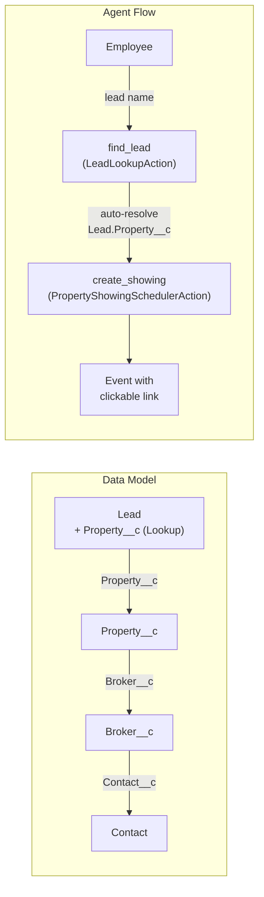

# Lead-to-Property Showing Agent Enhancement

## Current State

- **Data model**: `Property__c` -> `Broker__c` -> `Contact` (standard). No Lead customizations exist.
- **Agent**: `Property_Showing_Scheduler` (Employee Agent, v6) uses Agent Script DSL with two actions: `find_property` (PropertyLookupAction) and `create_showing` (PropertyShowingSchedulerAction).
- **Showings**: Standard `Event` records with `WhatId = Property__c`, `WhoId = Broker Contact`.
- **Confirmation**: Plain text message with Event ID, no clickable link.

## Architecture After Changes



---

## Functionality 1: Property Lookup on Lead

### 1a. Custom field: `Lead.Property__c`

Create a Lookup field on the standard Lead object pointing to `Property__c`.

- **File**: `force-app/main/default/objects/Lead/fields/Property__c.field-meta.xml`
- **Type**: Lookup(`Property__c`), optional, `deleteConstraint: SetNull`
- **Label**: "Property"
- **Relationship name**: `Leads`

### 1b. Lead Layout

Create a Lead layout that includes the new `Property__c` field so it appears on the standard Lead record page.

- **File**: `force-app/main/default/layouts/Lead-Lead Layout.layout-meta.xml`
- Include standard Lead fields (Name, Company, Status, Email, Phone, etc.) plus the new `Property__c` lookup in a prominent position.

### 1c. Permission set updates

- **dreamhouse.permissionset-meta.xml**: Add `fieldPermissions` for `Lead.Property__c` (editable + readable).
- **Employee_Scheduling_Agent_Access.permissionset-meta.xml**: Add read access to `Lead` object + `Lead.Property__c` field, and add `classAccesses` for the new `LeadLookupAction` and `PropertyLookupAction` Apex classes.

---

## Functionality 2: Agent Lead Lookup and Showing Creation

### 2a. New Apex class: `LeadLookupAction`

- **File**: `force-app/main/default/classes/LeadLookupAction.cls` + `.cls-meta.xml`
- `@InvocableMethod(label='Find Lead')`
- **Input**: `searchTerm` (String, required)
- **Output**: `leadId`, `leadName`, `propertyId`, `propertyName`, `propertyAddress`, `matchCount` (Integer), `matchList` (String), `errorMessage`
- **Logic**:
  1. Search `Lead` by `Name LIKE '%term%'` (query includes `Property__c`, `Property__r.Name`, `Property__r.Address__c`, `Property__r.City__c`, `Property__r.State__c`)
  2. Single match: populate all output fields including resolved property info
  3. Multiple matches: build numbered list with lead name + property name for disambiguation
  4. No match or lead has no Property__c: return appropriate error message
- **Style**: Follow existing patterns from `PropertyLookupAction.cls` -- `global with sharing`, init Response fields to `''`, `LIMIT 10`.

### 2b. Test class: `LeadLookupActionTest`

- **File**: `force-app/main/default/classes/LeadLookupActionTest.cls` + `.cls-meta.xml`
- PNB pattern: single match, multiple matches, no match, blank search term, lead without property

### 2c. Update `PropertyShowingSchedulerAction` confirmation message

Modify `PropertyShowingSchedulerAction.cls` line 139 to include a clickable Salesforce record link in the confirmation message:

```apex
// Current:
resp.confirmationMessage = 'Created event ' + resp.eventId + '.';

// New: include a deep link
String baseUrl = URL.getOrgDomainURL().toExternalForm();
resp.confirmationMessage = 'Property showing scheduled! [View Event]('
    + baseUrl + '/lightning/r/Event/' + resp.eventId + '/view)';
```

This produces a markdown-style link that Agentforce renders as clickable in the chat panel.

### 2d. Update Agent Script: `Property_Showing_Scheduler.agent`

Modify `Property_Showing_Scheduler.agent` to add a new topic `schedule_showing_for_lead` alongside the existing `schedule_showing` topic:

- **New variables**: `lead_id`, `lead_name`
- **New action** `find_lead` targeting `apex://LeadLookupAction`
  - Input: `searchTerm` (user input)
  - Outputs: `leadId`, `leadName`, `propertyId`, `propertyName`, `propertyAddress`, `matchCount`, `matchList`, `errorMessage`
- **Topic flow**: `find_lead` resolves lead -> auto-populates `property_id` from output -> calls existing `create_showing` action with the resolved property ID
- **Routing**: `start_agent` updated with two routing options -- "schedule showing for a property" vs "schedule showing for a lead"
- **Reasoning instructions**: Handle lead disambiguation (multiple matches), lead-without-property errors, and success with clickable event link

---

## Functionality 3: Clickable Event Link in Chat

Handled by the changes in 2c (Apex confirmation message includes markdown link) and 2d (agent reasoning instructions display the confirmation message which now contains the clickable link). The agent's existing pattern of surfacing `{!@variables.confirmation_msg}` in the reasoning block will automatically render the link.

---

## Files Changed/Created Summary

| Action | File |
|--------|------|
| Create | `force-app/main/default/objects/Lead/fields/Property__c.field-meta.xml` |
| Create | `force-app/main/default/layouts/Lead-Lead Layout.layout-meta.xml` |
| Create | `force-app/main/default/classes/LeadLookupAction.cls` |
| Create | `force-app/main/default/classes/LeadLookupAction.cls-meta.xml` |
| Create | `force-app/main/default/classes/LeadLookupActionTest.cls` |
| Create | `force-app/main/default/classes/LeadLookupActionTest.cls-meta.xml` |
| Edit | `force-app/main/default/classes/PropertyShowingSchedulerAction.cls` (clickable link) |
| Edit | `force-app/main/default/permissionsets/dreamhouse.permissionset-meta.xml` |
| Edit | `force-app/main/default/permissionsets/Employee_Scheduling_Agent_Access.permissionset-meta.xml` |
| Edit | `force-app/main/default/aiAuthoringBundles/.../Property_Showing_Scheduler.agent` |
